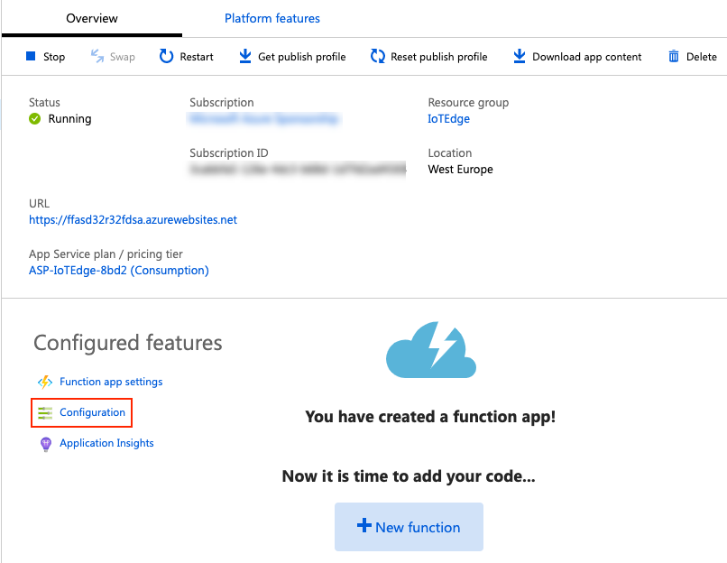

# IoT Edge Demos
This repo contains several projects that are part of an IoT Edge demo solution. 

## Demo scenario
The demo scenario is built around a big Shopping Mall. The manager of the mall wants to know at all times how busy the mall is. In order to get the necessary information to determine this, each shop entry is fitted with a motion-sensor. This sensor can detect whether a customer is entering the shop or exiting the shop. Every sensor sends an event to a central system every time this happens. These events are used to build a nice graphical overview of the traffic going in and out of all the shops:

At the top of the dashboard you can see an overview of all the shops (on level 1). Every shop's sensor is indicated with a blue circle. If a customer enters or exists the shop, the sensor indicator will flash green or red accordingly. 

Directly below the map you can see a graph that shows how crowded every shop is. Every shop has a certain maximum capacity. The bar indicates how much of the this capacity is in use. 

The bottom graph will show the progression of the total amount of customers in the mall over time.

## High-level overview of the solution
The solution for the Mall Management system is created using the following Azure services:

| Azure Service | Description |
|:--|:--|
|Azure IoT Hub | This is the central management and communications hub. IoT Edge devices connect to this hub. | 
| Azure IoT Edge | This is used for running sensor software on IoT Edge devices and communicate events to the IoT Hub. |
| Azure Function | This is used to ingest all events sent to the IoT Hub and publish these to a SignalR hub. |
| Azure SignalR Service | This is used to publish all messages received from the Azure Function to all SignalR clients listening to the SignalR hub. |

The visual dashboard is built using ASP.NET Core 

The solution works as follows:

1. Every door-sensor is simulated by a single IoT Edge module running on an IoT Edge device. Every sensor simulates customers going in or out of the shop at random intervals.
2. For every simulated customer, the Edge Module sends a message to the IoT Hub.
3. The event triggers an Azure Function app that reacts to events in the default IoT Hub event-queue.
4. The function app creates a message and sends it the SignalR hub.
5. The Visual Dashboard web-app gets the necessary credentials to connect to the SignalR service by calling the SignalRInfo Azure Function and connects to the hub.
6. The dashboard starts receiving messages from the SignalR hub.
7. With every incoming event, the dashboard updates the map and the graphs.

## Getting started
If you want to run this solution yourself, execute the steps in the getting started guide described below.

**Please take into consideration that this getting started guide is a work in progress and a rough brain-dump of the steps I took to get the solution up & running. If you find anything that does not work as described (or is not clear), please create an issue or change it yourself and do a pull request (sharing is caring ;) ).**

#### Prerequisites
1. Fork and clone this Git repository.
2. Create an **Container Registry** in Azure. 
	- Make sure you enable *Admin user-access* to the registry.
	- Choose the *Basic* SKU.
	- Once the registry is created, copy the user-name and password for this registry and keep this for later.
3. Create an **IoT Hub** in Azure.
	- Make sure you choose the *F1: Free* tier to enable IoT Edge. If you want to be able to send more than 8000 messages per day, choose the *S1: Standard* tier.
	- Once the IoT Hub is created, go to the *Built-in endpoints* blade for the hub and copy the *Event Hub-compatible endpoint* connection-string.
4.  Create a **simulated edge device VM** in Azure. 
	- Search *IoT Edge on Ubuntu* in the Azure Marketplace. You will find a template for VM with Ubuntu 16.04 LTS with the IoT Edge runtime pre-installed.
	- Create a VM based on this template.
	- Choose the *Standard B1ms* size VM.
	- You don't have to open any network ports or enable SSH / RDP access to the VM.
	- Choose the cheapest disk configuration and size possible.
5. Create a **SignalR service** in Azure.
	- Choose the *Free* pricing tier.
	- Once the SignalR service is created, copy the connection-string for this service from the *Keys* blade and keep this for later.
6. Create a **Function App** in Azure.
	- Choose *Windows* as OS.
	- Choose the *Consumption Plan* hosting plan.
	- Choose *.NET* as the runtime-stack.
7. Install the latest LTS version of the [.NET Core SDK](https://dotnet.microsoft.com/download).
8. Install the prerequisites for VS Code as described in [this article](https://docs.microsoft.com/en-us/azure/iot-edge/how-to-vs-code-develop-module). Only install the .NET / C# prerequisites.
9. Install the VS Code extension for *Azure Functions*.
10. Install Docker for Desktop.
11. Open the `iot-edge-demos.code-workspace` file in the repository using Visual Studio Code.

Once you have satisfied the prerequisites above, you can dive in and start the solution. Execute the following steps:

> For all the steps I assume that you have opened the `iot-edge-demos.code-workspace` file in the repository using Visual Studio Code.

#### Deploy the Azure Function app
1. Open the Azure Portal and select the Function App you created earlier.
2. Add 2 connection strings to the app settings:
	- Click the *Application Settings* option:  
      
	- Add an application setting *AzureSignalRConnectionString* with as value the connection-string to the SignalR service you copied earlier.
	- Add an application setting *IOTHUB_EVENTS* with as value the *Event Hub-compatible endpoint* connection-string you copied earlier.
3. Configure CORS for your Function App:
	- Open the Azure Portal, select your Function App and click the *CORS rules* option:  
      
	- Remove all the existing rules and add a new rule that allows `*`:  
	  
4. Deploy the function app from VS Code:
	- Right click the *Functions* folder in VS Code and select the `Deploy to Function App...` option.
	- Select your Function App.
	- Check the output window for any errors.

#### Configure the Dashboard web-app
1. Expand the *MallDashboard* folder in VS Code.
2. Configure the *SignalRInfo* function credentials:
	- Expand the */js* folder.
	- Rename the `secrets.sample.js` file to `secrets.js`.
	- Open the file.
	- Fill in the variables:
		- The name of your Function App.
		- The default function-key of the *SignalRInfo* function. You can get this key by opening the Function App in the Azure Portal, selecting the *SignalRInfo* function and clicking the *Manage* option:  
		

#### Connecting to your IoT Hub
2. Make sure you are signed into an Azure subscription from VS Code.
	- Press the short-cut key `Ctrl-Shift-P` to open the command-list.
	- Type `Azure: Sign in` and select the command from the list.
	- Login with your credentials.
3. Select your IoT Hub.
	- Press the short-cut key `Ctrl-Shift-P` to open the command-list.
	- Type `IoT Hub: Select IoT Hub` and select the command from the list.
	- Select the subscription that contains the IoT Hub you created earlier.
	- Select your IoT Hub.
4. Display the Azure IoT Hub Devices explorer in the sidebar (if not already visible):
	- Click the *View* menu.
	- Select the *Open View...* option.
	- Type `IoT` and select the `Azure IoT Hub Devices` view.		  

#### Build and push the IoT Edge module image
2. Expand the EdgeModules project in VS Code.
3. Configure the container registry credentials:
	- Rename the `.env.sample` file to `.env`.
	- Open the file.
	- Fill in the variables:
		- The address of your container registry (e.g. mycr.azurecr.io)
		- The user name for this registry.
		- The password for this registry.
4. Select the target platform for your device:
	- Press the short-cut key `Ctrl-Shift-P` to open the command-list.
	- Select command `IoT Edge: Set default Target Platform for Edge Solution`.
	- Select the target platform (`arm32-v7` for a Raspberry Pi, `amd64` for a linux host and `windows-amd64` for a Windows host).
	- You can also see a shortcut in the status-bar of VS Code you can use to change the target platform:  
	  
5. Make sure your Docker for Desktop is running.
6. Right click the `deployment.template.json` file and select the option `Build and Push IoT Edge Solution`.
7. Check out the output window for any errors.
	- If you see an error about authentication, make sure you're logged into your container registry. You can do this by opening a terminal window and issuing the command `docker login <registry address>`. You will be prompted for a user name and password.
	- If you see an error about not being able to contact the Docker daemon, your Docker for Desktop is probably not running (correctly). Start it (or restart it if it is running).
8. Check out whether the image was pushed correctly by opening the container registry and checking whether there is a repository named `sensormodule` with an image in it named `1.0-<patform>`.

#### Add an edge device
Coming soon!

#### Deploy the sensor modules to your device
Coming soon!

