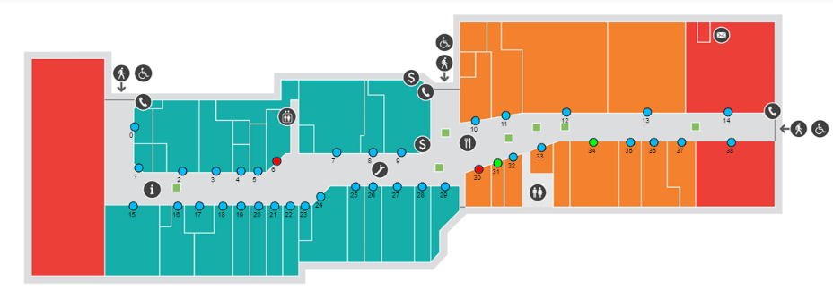
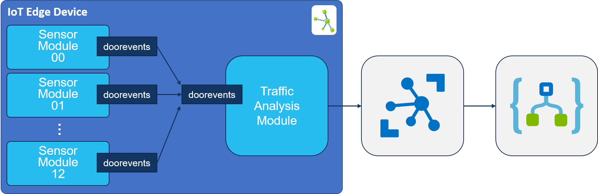
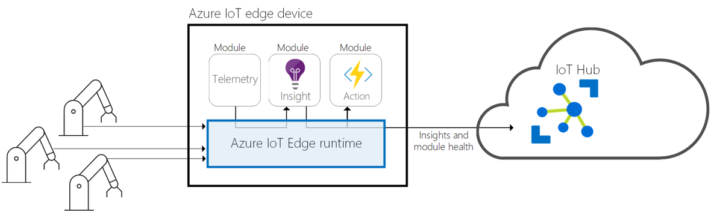

# IoT Edge Demos - Stretch Goal
If you have followed the README and have the entire solution up & running, you can try to achieve the stretch-goal:

### When a store exceeds 90% of its maximum capacity, a fire-hazard alert is sent to the fire-department.

A section in this case is one of the 3 IoT Edge devices that runs 13 of the store modules:



| Section | Sensors |
|:-:|:--|
| 1 | Sensor00 - Sensor12 |
| 2 | Sensor13 - Sensor25 |
| 3 | Sensor26 - Sensor38 |

### TrafficAnalysis module
The stretch goal must be achieved by accumulating all the traffic sent from within 1 section in a separate **Traffic Analysis Module**. This module will ingest all the messages sent by the sensor-modules running in the same Edge device and determine whether or not an alert needs to be sent to the fire-brigade. If that is the case, the TrafficAnalysis module will sent a special message to IoT Hub which must trigger a **Logic App** that will send the actual alert to the fire-brigade.

The setup will look like this:  



In order to route messages between the doorsensor-modules and trafficanalysis module, you need to configure message-routing on the Edge device.

#### Add a new module to the IoT Edge demo solution
First, you need to add a new module to the solution. Right-click the *EdgeModules* project in the solution and select the option *Add IoT Edge Module*. Select the *C# Module * template, name the module *TrafficAnalysisModule* and specify the following repository: *[your ACR name]/TrafficAnalysisModule*. Specify the container-registry you used in the workshop.

The code for the TrafficAnalysis module is shown below. You can just copy-paste it into the *Program.cs* file that was created when added the module (replacing the existing content). But make sure you go over the code to understand what it does.

```c#
namespace TrafficAnalysisModule
{
    using System;
    using System.Linq;
    using System.Runtime.Loader;
    using System.Text;
    using System.Threading;
    using System.Threading.Tasks;
    using Microsoft.Azure.Devices.Client;
    using Microsoft.Azure.Devices.Client.Transport.Mqtt;
    using Newtonsoft.Json;

    internal class StoreStatus
    {
        public int StoreId { get; set; }
        public int? StoreMaxCapacity { get; set; }
        public int? CurrentCustomerCount { get; set; }
    }

    class Program
    {
        private static Mutex _mutex = new Mutex();

        private static StoreStatus[] _storeAllocation;

        static void Main(string[] args)
        {
            // build local state structure
            _storeAllocation = new StoreStatus[13];
            for (int i = 0; i < 12; i++)
            {
                _storeAllocation[i] = new StoreStatus { StoreId = i };
            }

            Init().Wait();

            // Wait until the app unloads or is cancelled
            var cts = new CancellationTokenSource();
            AssemblyLoadContext.Default.Unloading += (ctx) => cts.Cancel();
            Console.CancelKeyPress += (sender, cpe) => cts.Cancel();
            WhenCancelled(cts.Token).Wait();
        }

        /// <summary>
        /// Handles cleanup operations when app is cancelled or unloads
        /// </summary>
        public static Task WhenCancelled(CancellationToken cancellationToken)
        {
            var tcs = new TaskCompletionSource<bool>();
            cancellationToken.Register(s => ((TaskCompletionSource<bool>)s).SetResult(true), tcs);
            return tcs.Task;
        }

        /// <summary>
        /// Initializes the ModuleClient and sets up the callback to receive
        /// messages containing temperature information
        /// </summary>
        static async Task Init()
        {
            MqttTransportSettings mqttSetting = new MqttTransportSettings(TransportType.Mqtt_Tcp_Only);
            ITransportSettings[] settings = { mqttSetting };

            // Open a connection to the Edge runtime
            ModuleClient ioTHubModuleClient = await ModuleClient.CreateFromEnvironmentAsync(settings);
            await ioTHubModuleClient.OpenAsync();
            Console.WriteLine("IoT Hub module client initialized.");

            // Register callback to be called when a message is received by the module
            await ioTHubModuleClient.SetInputMessageHandlerAsync("doorevents", HandleMessage, ioTHubModuleClient);
        }

        static async Task<MessageResponse> HandleMessage(Message message, object userContext)
        {
            var moduleClient = userContext as ModuleClient;
            if (moduleClient == null)
            {
                throw new InvalidOperationException("UserContext doesn't contain " + "expected values");
            }

            string notificationJson = Encoding.UTF8.GetString(message.GetBytes());
            if (!string.IsNullOrEmpty(notificationJson))
            {
                _mutex.WaitOne();

                // parse notification
                (int ModuleId, int MaxCapacity, int CustomerCount) notification =
                    JsonConvert.DeserializeObject<(int ModuleId, int MaxCapacity, int CustomerCount)>(notificationJson);
        
                // update local state
                int storeIndex = notification.ModuleId;
                _storeAllocation[storeIndex].StoreMaxCapacity = notification.MaxCapacity;
                _storeAllocation[storeIndex].CurrentCustomerCount = notification.CustomerCount;

                // determine whether the threshold has been crossed
                int accumulatedCustomerCount = _storeAllocation.Sum(
                    s => s.CurrentCustomerCount.HasValue ? s.CurrentCustomerCount.Value : 0);
                int totalCapacity = _storeAllocation.Sum(
                    s => s.StoreMaxCapacity.HasValue ? s.StoreMaxCapacity.Value : 0);

                if ((accumulatedCustomerCount / totalCapacity) * 100 > 50)
                {
                    // send fire hazard notification
                    string fireHazardNotification = "FIREHAZARD!!";
                    Message fireHazardNotificationMessage = new Message(Encoding.UTF8.GetBytes(fireHazardNotification));
                    await moduleClient.SendEventAsync(fireHazardNotificationMessage);
                }
    
                _mutex.ReleaseMutex();
            }

            return MessageResponse.Completed;
        }
    }
}
```

#### IoT Edge message-routing
IoT Edge offers the ability to route traffic between Edge Modules that are deployed on an Edge device:

 

You can specify the routing rules in the configuration-section for the edgeHub module in the deployment-manifest file:

```json
"$edgeHub": {
  "properties.desired": {
    "routes": {
      "{route1}": "FROM <source> INTO <sink>",
      "{route2}": "FROM <source> INTO <sink>"
    },
  }
}
```

A *source* is a module producing messages. You can specify to route all messages or the messages from a specific output:

| Source | Description |
| ------ | ----------- |
| `/*` | All device-to-cloud messages or twin change notifications from any module or leaf device |
| `/twinChangeNotifications` | Any twin change (reported properties) coming from any module or leaf device |
| `/messages/*` | Any device-to-cloud message sent by a module through some or no output, or by a leaf device |
| `/messages/modules/*` | Any device-to-cloud message sent by a module through some or no output |
| `/messages/modules/<moduleId>/*` | Any device-to-cloud message sent by a specific module through some or no output |
| `/messages/modules/<moduleId>/outputs/*` | Any device-to-cloud message sent by a specific module through some output |
| `/messages/modules/<moduleId>/outputs/<output>` | Any device-to-cloud message sent by a specific module through a specific output |

A *sink* is a module receiving the messages. This can also be the IoT Hub:

| Sink | Description |
| ---- | ----------- |
| `$upstream` | Send the message to IoT Hub |
| `BrokeredEndpoint("/modules/<moduleId>/inputs/<input>")` | Send the message to a specific input of a specific module |

You can use the following route specification: 

```json
"$edgeHub": {
  "properties.desired": {
    "routes": {
      "DoorSensorToAnalysis": "FROM /messages/modules/*/doorevents INTO BrokeredEndpoint(\"/modules/TrafficAnalysisModule/inputs/doorevents\"),",
      "AnalysisToCloud": "FROM /messages/modules/TrafficAnalysisModule/* INTO $upstream"
    },
  }
}
```

